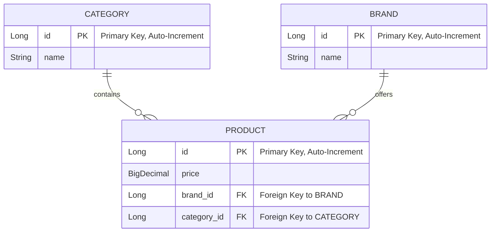

# MSS - 코디 서비스 프로젝트


## Features

1. **고객은 카테고리 별로 최저가격인 브랜드와 가격을 조회하고 총액이 얼마인지 확인할 수 있어야 합니다.**

2. **고객은 단일 브랜드로 전체 카테고리 상품을 구매할 경우 최저가격인 브랜드와 총액이 얼마인지 확인할 수 있어야 합니다.**

3. **고객은 특정 카테고리에서 최저가격 브랜드와 최고가격 브랜드를 확인하고 각 브랜드 상품의 가격을 확인할 수 있어야 합니다.**

4. **운영자는 새로운 브랜드를 등록하고, 모든 브랜드의 상품을 추가, 변경, 삭제할 수 있어야 합니다.t**

## Data

### Schema


## Getting Started

### Prerequisites
- JDK 17
- Gradle 8.8

### Installing

1. **Clone the repository:**

   ```bash
   git clone https://github.com/noakafka/MSS.git
   cd MSS
   ```

2. **Build the project:**

   ```bash
   ./gradlew clean build
   ```

3. **Run the application:**

   ```bash
   ./gradlew bootRun
   ```

## Running the Tests

To run the automated tests for this system, use the following command:

```bash
./gradlew test
```

## Built With

* [Spring Boot 3.3.2](https://spring.io/projects/spring-boot) - The web framework used
* [Kotlin 1.9.24](https://kotlinlang.org/) - The programming language
* [Gradle](https://gradle.org/) - Dependency Management
* [H2 Database](https://www.h2database.com/html/main.html) - In-memory database used for testing
* [Ehcache](https://www.ehcache.org/) - Cache provider for caching functionalities
* [Mockito](https://site.mockito.org/) - For creating mock objects in tests