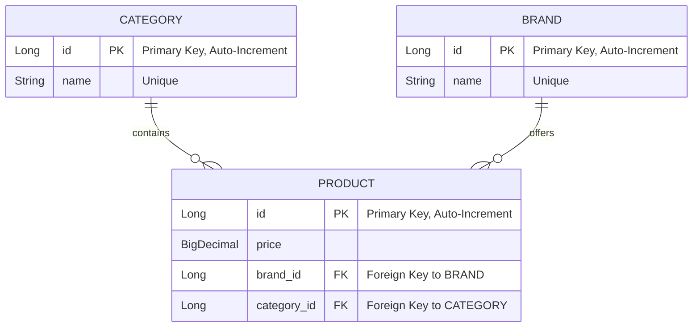

# MSS - 코디 서비스 프로젝트
- **Application이 로컬에서 실행되면, http://localhost:8080/ 에서 Frontend 페이지를 확인할 수 있습니다.**

## Features

1. **고객은 카테고리 별로 최저가격인 브랜드와 가격을 조회하고 총액이 얼마인지 확인할 수 있어야 합니다.**
   - 최저가격이 동일하다면, 가장 최근에 업데이트된 상품을 조회합니다.


2. **고객은 단일 브랜드로 전체 카테고리 상품을 구매할 경우 최저가격인 브랜드와 총액이 얼마인지 확인할 수 있어야 합니다.**
   - 최저가격이 동일하다면, 가장 최근에 상품이 업데이트된 브랜드를 최저가격 브랜드로 조회합니다.
   - 모든 카테고리를 가지고 있는 브랜드만 조회합니다.


3. **고객은 특정 카테고리에서 최저가격 브랜드와 최고가격 브랜드를 확인하고 각 브랜드 상품의 가격을 확인할 수 있어야 합니다.**
   - 최저,최고가격이 동일하다면, 가장 최근에 업데이트된 상품을 조회합니다.


4. **운영자는 새로운 브랜드를 등록하고, 모든 브랜드의 상품을 추가, 변경, 삭제할 수 있어야 합니다.**
   - 중복되는 이름의 브랜드는 생성, 변경할 수 없습니다.
   - 상품을 가지고 있는 브랜드는 삭제할 수 없습니다.

## Conditions
- **주어진 데이터가 h2 데이터베이스에 세팅된 상태로 Application이 실행됩니다.**

| 브랜드 | 상의   | 아우터 | 바지  | 스니커즈 | 가방  | 모자  | 양말  | 액세서리 |
|--------|--------|--------|-------|----------|-------|-------|-------|----------|
| A      | 11,200 | 5,500  | 4,200 | 9,000    | 2,000 | 1,700 | 1,800 | 2,300    |
| B      | 10,500 | 5,900  | 3,800 | 9,100    | 2,100 | 2,000 | 2,000 | 2,200    |
| C      | 10,000 | 6,200  | 3,300 | 9,200    | 2,200 | 1,900 | 2,200 | 2,100    |
| D      | 10,100 | 5,100  | 3,000 | 9,500    | 2,500 | 1,500 | 2,400 | 2,000    |
| E      | 10,700 | 5,000  | 3,800 | 9,900    | 2,300 | 1,800 | 2,100 | 2,100    |
| F      | 11,200 | 7,200  | 4,000 | 9,300    | 2,100 | 1,600 | 2,300 | 1,900    |
| G      | 10,500 | 5,800  | 3,900 | 9,000    | 2,200 | 1,700 | 2,100 | 2,000    |
| H      | 10,800 | 6,300  | 3,100 | 9,700    | 2,100 | 1,600 | 2,000 | 2,000    |
| I      | 11,400 | 6,700  | 3,200 | 9,500    | 2,400 | 1,700 | 1,700 | 2,400    |


## Data

### Schema


## Getting Started

### Prerequisites
- JDK 17
- Gradle 8.8

### Installing

1. **Clone the repository:**

   ```bash
   git clone https://github.com/noakafka/MSS.git
   cd MSS
   ```

2. **Build the project:**

   ```bash
   ./gradlew clean build
   ```

3. **Run the application:**

   ```bash
   java -jar build/libs/assignment-0.0.1-SNAPSHOT.jar
   ```

## Running the Tests

To run the automated tests for this system, use the following command:

```bash
./gradlew test
```

## Built With

* [Spring Boot 3.3.2](https://spring.io/projects/spring-boot) - The web framework used
* [Kotlin 1.9.24](https://kotlinlang.org/) - The programming language
* [Gradle](https://gradle.org/) - Dependency Management
* [H2 Database](https://www.h2database.com/html/main.html) - In-memory database used for testing
* [Ehcache](https://www.ehcache.org/) - Cache provider for caching functionalities
* [Mockito](https://site.mockito.org/) - For creating mock objects in tests
